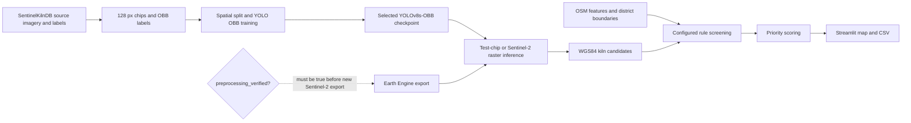

# KilnWatch BD architecture

## Data flow

SentinelKilnDB supplies model-training chips. New Sentinel-2 composites are an
optional inference input; the export gate remains closed while
`config/preprocessing.yaml` has `preprocessing_verified: false`. Inference
converts model detections to WGS84 geometries. The rules stage compares those
candidates with configured OSM features and rules. Scoring ranks candidates
for review. The dashboard presents every output as an **unverified screening
candidate**.

## Model card

| Field | Recorded value |
|---|---|
| Dataset | SentinelKilnDB; CC BY-NC 4.0; Bangladesh only |
| Architecture | YOLOv8s-OBB |
| Training image size | 512 px |
| Classes | FCBK, Zigzag |
| Test mAP50 | 0.752 |
| Test FCBK AP50 | 0.601 |
| Test Zigzag AP50 | 0.904 |
| Configured training epochs | 50 |
| Early stopping patience | 10 |

## Known limitations

- The test confusion matrix records 68 FCBK instances classified as Zigzag
  and 92 Zigzag instances classified as FCBK. FCBK AP50 is lower than Zigzag
  AP50; this class confusion requires model/data work and cannot be corrected
  by a dashboard-only change.
- The imagery-to-ground-truth date gap is unresolved. The published dataset
  date descriptions conflict, and the exact relation between imagery dates
  and labels has not been established.
- Configured rules are screening proxies. Their signals do not establish a
  legal finding or status for an individual candidate.
- OSM feature geometry is not a legally controlling boundary source. Distance
  results depend on the mapped feature coverage and geometry.
- No field validation has been completed. Detection location, class, and
  screening signals need review before operational use.

## Advisory language

Every dashboard marker, table row, and export is an **unverified screening
candidate**. The map and ranking support human review; they do not establish
ground truth or legal status.
