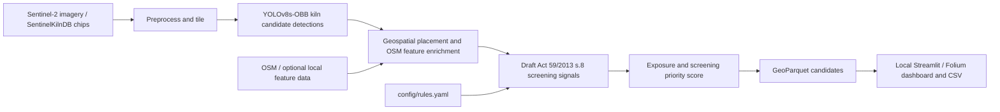

# KilnWatch BD — Round 2 Architecture

## Project and team

- **Project:** KilnWatch BD
- **Team:** KilnWatch BD project team, Hack for Humanity Bangladesh 2026. The repository does not record individual team-member names or a separate registered team name.

## Problem

Brick kiln locations are difficult to screen consistently across Bangladesh, and field inspection capacity is limited. KilnWatch BD uses Sentinel-2 imagery to identify candidate kilns, compares candidates with mapped features and draft siting/technology rules, and ranks them for human review. The result is a triage aid, not a determination that a kiln is illegal.

## Pipeline

Earth Engine is an intended source for new imagery exports; export is currently gated because preprocessing has not been verified. The completed detector evaluation used the supplied SentinelKilnDB chips.

## Model and reported evaluation

The selected detector is **YOLOv8s-OBB** at 512 px. Its held-out SentinelKilnDB test results are:

| Metric | Result |
|---|---:|
| mAP50 | 0.752 |
| FCBK AP50 | 0.601 |
| Zigzag AP50 | 0.904 |

These are dataset test metrics, not field-accuracy estimates. FCBK performance is materially lower than Zigzag performance. The saved visual review did not cover representative positive test detections, so manual review remains necessary. See [training run history](TRAINING_RUN_HISTORY.md).

## Data and split

SentinelKilnDB is used under **CC BY-NC 4.0**. The Round 2 brief gives **11,409 Bangladesh chips**; the current generated `split_report.json` instead records 11,517 chips inside Bangladesh, 11,250 written, and 267 validation/test chips removed by the leakage filter. Reconcile these counts before presenting one as the final dataset size. The retained split is spatially grouped into 0.25° cells at 70/15/15 train/validation/test proportions, with an additional 1,300 m Chebyshev-distance filter between splits. The dataset authors' supplied split was class-stratified, so the project re-split by location to reduce overlap leakage.

## Rules and legal status

The legal reference is the **Brick Manufacturing and Kiln Establishment (Control) Act, 2013 (Act 59 of 2013), section 8**, as amended. The thresholds below are candidate screening distances described in the legal review; they are **not verified legal findings**:

- **1 km:** listed prohibited-area boundaries and the listed schools/educational institutions, hospitals/clinics, research institutions, and railways, subject to the Act's categories and reference geometries.
- **2 km:** boundary of **government** forest. This is not a generic buffer around every mapped forest.
- **Current implementation:** `config/rules.yaml` contains 1 km school, hospital, and settlement proxies. Settlement geometry does not establish the Act's legal categories. Railway, government-forest, and other statutory categories are not implemented in the active rules. The school/hospital/settlement layers and all rule thresholds remain unverified.

The legislation's current force, interpretation, and GIS reference geometries have not been independently established. See [legal basis and verification record](legal_basis.md). Model class is also not a legal technology determination: the FCBK flag is a project heuristic.

## Deployment and stack

The dashboard runs locally with Streamlit and reads local processed GeoParquet. The pipeline is offline-capable when its imagery, feature data, and caches are already available locally. The current OpenStreetMap and Esri basemap tiles require network access, so the map is not fully offline without cached/local tiles. The stack includes Python, PyTorch/Ultralytics YOLOv8 OBB, Earth Engine for a future imagery-export path, GeoPandas, Shapely, pyproj, Streamlit, Folium, and OSMnx/pyrosm.

## Limitations

- `config/preprocessing.yaml` has `preprocessing_verified: false`; the published acquisition dates conflict and training-to-export chip calibration is incomplete.
- No field validation or independent field-accuracy measurement has been completed.
- Outputs are screening candidates, not legal findings or evidence of kiln establishment date, licensing, or compliance.
- Rule thresholds and mapped-feature coverage remain unverified; mapped geometry can differ from legally controlling boundaries.
- FCBK AP50 (0.601) is lower than Zigzag AP50 (0.904), and positive detections still need visual review.
- The repository's current dashboard does not yet expose interactive district/class filters or show mapped-school distance in its popup. Do not claim those live capabilities until implemented.
